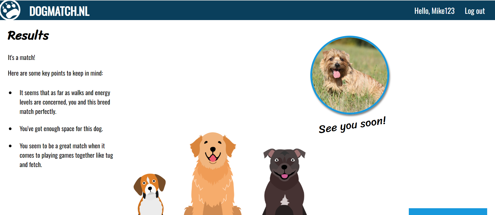

Hallo,

Dit is mijn eindopdracht voor de frontend. Op deze applicatie kun je kijken welk hondenras het best bij jou past. 

Om dit project te starten heb je een Api key nodig. 
Deze is gratis beschikbaar op https://api-ninjas.com/. 
Je mag ook gebruikmaken van mijn api key: OvzRvYsVHUUcIgk5PKl5Brg1I4eWGN7toxXd1mvk 

Maak hiervoor een .env bestand aan in de root map. 
Kopieer de tekst uit .env.dist en zet deze in je .env bestand, gevolgd door de Api key (zonder aanhalingstekens). 

Voer het commando 'npm run build' uit.  

Het project is nu klaar om opgestart te worden.